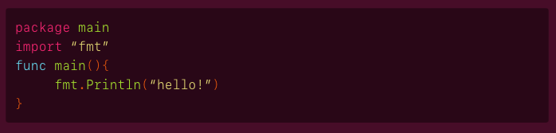
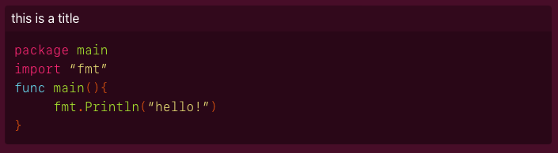
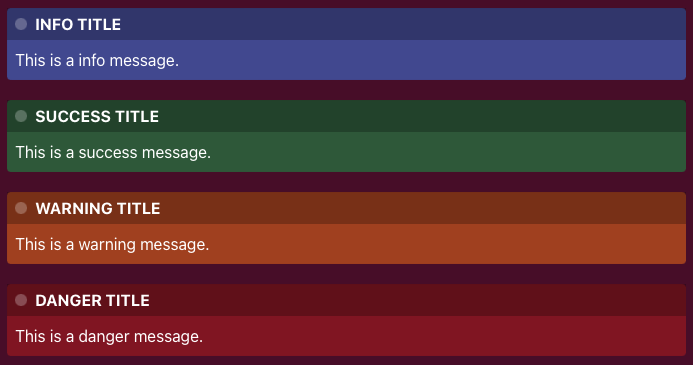

# markdownutils

## Installation

```go get github.com/ksckaan1/markdownutils```

## Features

> Important: Outputs are stylized.

### Classic Markdown

```md
# Hello

## Hello

### Hello

`inline code`
.
.
.
.
```

### Classed Code Area

    ```go
    package main
    import "fmt"
    func main(){
        fmt.Println("hello!")
    }
    ```


**HTML OUTOUT**

HTML output is classed.

```html
<div class="customcode">
<code class="lang-go">
<pre><span class="line"><span class="cl"><span class="kn">package</span> <span class="nx">main</span>
</span></span><span class="line"><span class="cl"><span class="kn">import</span> <span class="s">“fmt”</span>
</span></span><span class="line"><span class="cl"><span class="kd">func</span> <span class="nf">main</span><span class="p">(){</span>
</span></span><span class="line"><span class="cl">     <span class="nx">fmt</span><span class="p">.</span><span class="nf">Println</span><span class="p">(</span><span class="s">“hello!”</span><span class="p">)</span>
</span></span><span class="line"><span class="cl"><span class="p">}</span>
</span></span></pre>
</code>
</div>
```

### Classed Code Area with Title

    ```go this is a title
    package main
    import "fmt"
    func main(){
        fmt.Println("hello!")
    }
    ```



**HTML OUPUT**

HTML output is classed.

```html
<div class="customcode">
<div class="title">this is a title</div>
<code class="lang-go">
<pre><span class="line"><span class="cl"><span class="kn">package</span> <span class="nx">main</span>
</span></span><span class="line"><span class="cl"><span class="kn">import</span> <span class="s">“fmt”</span>
</span></span><span class="line"><span class="cl"><span class="kd">func</span> <span class="nf">main</span><span class="p">(){</span>
</span></span><span class="line"><span class="cl">     <span class="nx">fmt</span><span class="p">.</span><span class="nf">Println</span><span class="p">(</span><span class="s">“hello!”</span><span class="p">)</span>
</span></span><span class="line"><span class="cl"><span class="p">}</span>
</span></span></pre>
</code>
</div>
```

### Hint Boxes

    :::info INFO TITLE
    This is a info message.
    :::

    :::success SUCCESS TITLE
    This is a success message.
    :::
    
    :::warning WARNING TITLE
    This is a warning message.
    :::

    :::danger DANGER TITLE
    This is a danger message.
    :::




### YouTube Video

    :::youtube vjHAvx47d98:::

